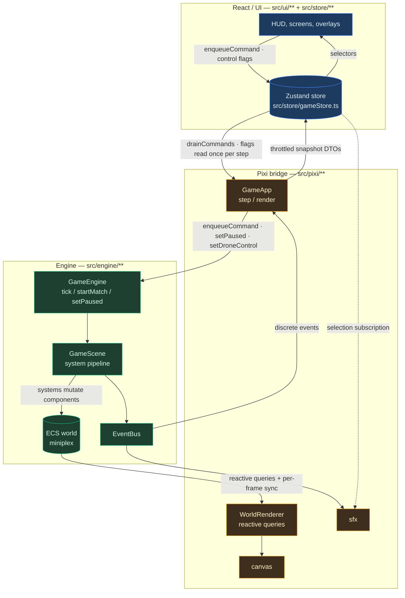
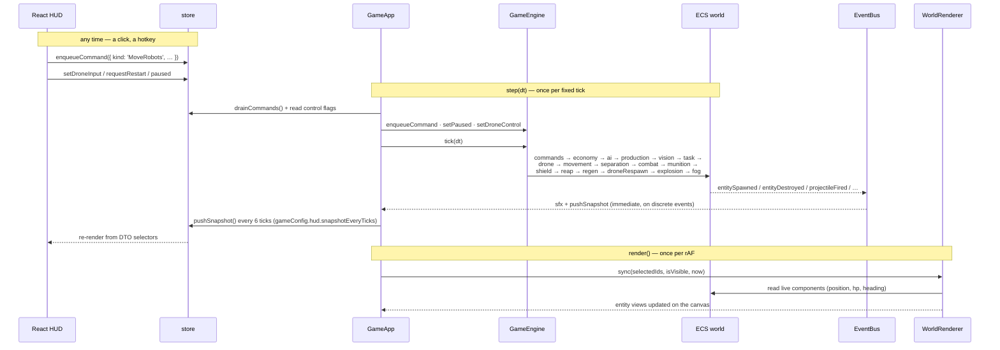
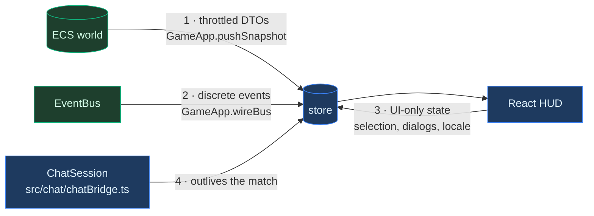
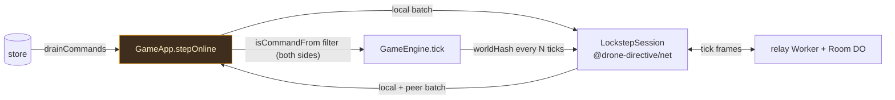

# `@drone-directive/client` — the game

The web game itself: all app code, configs, `index.html` and `public/`. Source
lives under `src/**`, the production build lands in `dist/`.

This README is about **how the three layers inside `src/` talk to each other**.
For what each layer contains, see the per-layer skills in
[`.claude/skills/`](../.claude/skills/) (`dd-engine`, `dd-pixi`, `dd-react`); for
the ECS model itself see [`.docs/engine-ecs.md`](../.docs/engine-ecs.md), and for
why the store looks the way it does, [`.docs/zustand.md`](../.docs/zustand.md).

## The three layers, and the one rule each

| Layer      | Lives in                     | May import                                                      | Must never import                                                    |
| ---------- | ---------------------------- | --------------------------------------------------------------- | -------------------------------------------------------------------- |
| **Engine** | `src/engine/**`              | `@drone-directive/types`, `src/config/**`                       | React, Pixi, the store, `net`/`protocol` (it must not know the wire) |
| **Pixi**   | `src/pixi/**`                | `src/engine/**`, the store (vanilla), `net` (in `GameApp` only) | React                                                                |
| **UI**     | `src/ui/**` + `src/store/**` | the store, `src/config/**`, `src/i18n/**`                       | Pixi objects, ECS entities                                           |

`src/store/**` sits deliberately **outside** `ui/`: the Pixi bridge reads it too,
so it is a shared seam rather than a React implementation detail.

The whole architecture rests on one invariant, stated at the top of
[`src/store/types.ts`](src/store/types.ts):

> Snapshots are flat projections of ECS entities, **never the entities
> themselves**. React must not hold a reference into the simulation.

## The loop



Read it as two one-way currents: **intent flows down** (UI → store → GameApp →
engine), **state flows up** (ECS world → renderer/snapshots → UI). Nothing
crosses sideways — the UI never calls the engine, and the engine never knows the
UI exists.

## One frame, in order

`GameLoop` runs a fixed 30 Hz step plus a render pass. `GameApp` owns both.



The split is the point: **live values are read by Pixi every frame directly off
the ECS world; the store only gets a throttled projection.** Pushing per-frame HP
into Zustand would re-render the React tree 30 times a second for numbers Pixi is
already drawing.

## Four channels into the UI — and why there are four



1. **Snapshots** — `BaseSnapshot` / `RobotSnapshot` / `SideSnapshot` /
   `DroneStatus`, built by `GameApp`'s converters from archetype-typed queries.
   This is the render-state channel.
2. **EventBus** — a _supplement_, never a state channel: one-off notifications
   (`entitySpawned`, `entityDestroyed`, `baseDestroyed`, `projectileFired`,
   `shieldRaised`, `shieldEnded`, `sideEliminated`, `gameOver`, `sceneChanged`).
   `GameApp` turns them into sounds, an extra snapshot push, and status changes.
3. **UI-only state** the engine never hears about — most notably **selection**,
   which is why `selectionAudio` is a store subscription rather than a bus
   listener.
4. **Chat**, which must **outlive** the match, so it is a module singleton
   outside `pixi/` and nothing in `GameApp`'s teardown touches it.

### Audio runs off three of them

Sound is the clearest illustration that these channels are not interchangeable:

| Source                                         | Channel                       | Why that one                                              |
| ---------------------------------------------- | ----------------------------- | --------------------------------------------------------- |
| shots, explosions, a robot leaving the factory | EventBus                      | things the **simulation** did                             |
| selection cues                                 | store subscription            | selection is store-only; the engine never learns about it |
| button clicks, chat send                       | direct call from `ui/common/` | the **interface** made the sound, not the game            |

## Where the network enters



Online play is **not** a fourth layer. `GameApp` is the only file in `client/`
that touches `net`, and it injects the relay URL and world bounds through
[`src/config/multiplayer.ts`](src/config/multiplayer.ts). The engine stays
wire-ignorant; the desync probe (`src/engine/worldHash.ts`) lives in the engine
only because it has to read the ECS world.

Both peers apply commands **by entity id**, on the same tick, through the same
`isCommandFrom` filter — an input filter only one side applies is a desync.

## The single React↔Pixi seam

There is exactly one, and it is deliberately tiny:

```
ui/GameCanvas.tsx  →  ui/hooks/useGameApp.ts  →  pixi/GameApp.init(host)
```

`GameCanvas` renders a bare `<div>` and nothing else. React owns that element;
Pixi owns everything drawn inside it. No React component anywhere imports a Pixi
object or an ECS entity.

## Commands

Inside `client/`: `npm run test:watch` to iterate on engine tests.

## Screenshots

`npm run shot` boots the game in a real browser, clicks through the menu into a
match, and writes a PNG. It starts and stops its own dev server, so there is no
setup step:

```
npm run shot                                          # → client/screenshots/shot.png
npm run shot -- --seed 7 --query 'fog=0' --out a.png  # a fixed map, no fog
npm run shot -- --menu --out menu.png                 # stop at the main menu
npm run shot -- --url http://localhost:5173           # reuse a dev server already up
```

Two things make it worth reaching for rather than writing a one-off script:

- **`--seed` pins the battlefield.** Maps are generated from the clock, so two
  runs without it photograph two different maps — and a render change judged
  against that pair is being judged against noise. It is `?seed=` on the URL
  (`pixi/perf/perfFlags.ts`), so it works when clicking around by hand too.
- **`--query` reaches the render switches**, the same ones the perf work uses:
  `?fog=0`, `?peaks=0`, `?debris=0`, `?terrain=0`. A before/after of one layer is
  `--query 'debris=0'` against nothing.

It drives the browser through `playwright-core` and a Chromium **already on the
machine** — no 300 MB postinstall download. `scripts/lib/chromium.mjs` explains
the search order and `DD_CHROMIUM` if it picks the wrong one; `scripts/lib/game.mjs`
holds the dev-server + enter-a-match part, which is what a visual test would reuse.
Output goes to `client/screenshots/`, which is git-ignored.
